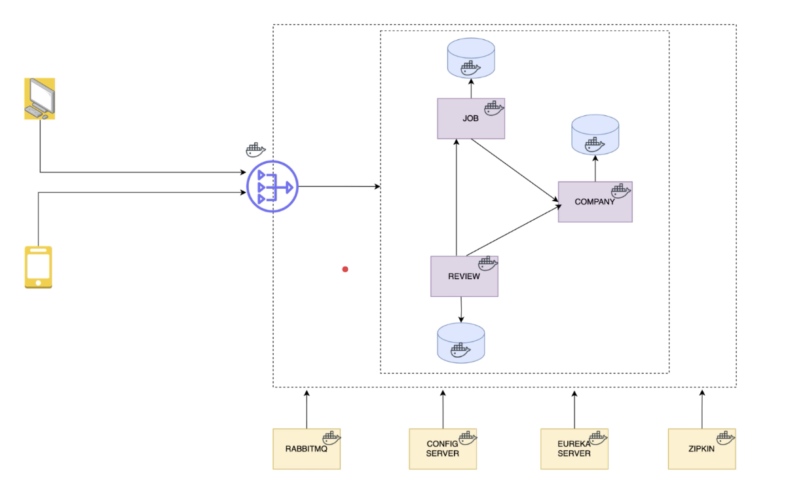

# spring-microservices

Microservices with Spring Boot and deployment on k8s

## Architecture

- 

## Zipkin

- [Using Docker to run Zipkin instance](https://zipkin.io/pages/quickstart.html)

```
  docker run -d -p 9411:9411 openzipkin/zipkin
```

- Add Zipkin configs to Docker compose:

```yaml
zipkin:
  image: openzipkin/zipkin
  container_name: zipkin
  ports:
    - 9411:9411
  networks:
    - postgres
```

- Using docker compose: `docker-compose up -d`

- Zipkin, in Production we should not track every request with probability 1.0

## Micrometer

- Micrometer provide metrics collection for your applications
- Micrometer is vendor agnostic, it abstracts all the metrics from your application with integrations to various cloud providers, such as Datadog, Prometheus, New Relic, Grafana, etc.

## If using with OpenFeign, need extra dependency

```pom.xml
  <dependency>
    <groupId>io.micrometer</groupId>
    <artifactId>micrometer-tracing-bridge-brave</artifactId>
  </dependency>
  <dependency>
    <groupId>io.zipkin.reporter2</groupId>
    <artifactId>zipkin-reporter-brave</artifactId>
  </dependency>
  <dependency>
    <groupId>io.github.openfeign</groupId>
    <artifactId>feign-micrometer</artifactId>
  </dependency>
```

## Setup

- Run `docker compose up -d` to start the Postgres and pgAdmin containers
- Package the application into a JAR file under `target` folder

```bash
  mvn clean package
  ./mvmw package
```

Specify packaging type (default = `jar`, other options is `war` and `ear`)

```pom.xml
<packaging>jar</packaging>
```

- Running the application with `jar` locally

```bash
    jar -tf ./target/companyms-0.0.1-SNAPSHOT.jar
    java -jar ./target/companyms-0.0.1-SNAPSHOT.jar
```

This will require `jdk` path to be set in .zshrc

##
